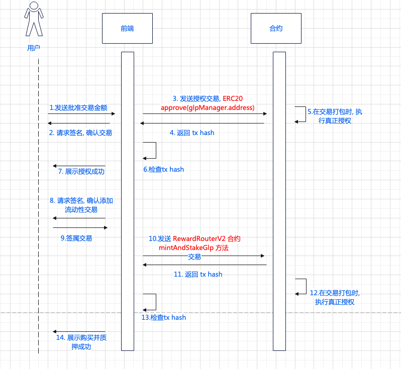
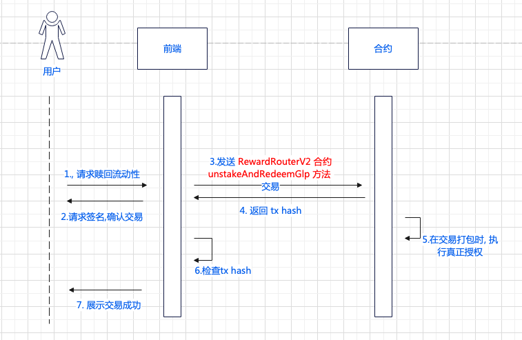

# 添加流动性/质押gsp
# 相关合约: 

GspRewardRouter(实际调用对象): 0x6423B678D59D937f7B1196237d48034e04B4007E

GspManager(授权对象): 0x22140C7483D5D5bd4ed79b38f600cF45053Ee02B

# 主要接口
   - mintAndStakeGsp   普通代币购买并质押Gsp, 该调用需要授权的步骤
```
    function mintAndStakeGsp(
        address _token,    // 质押token,  用户输入
        uint256 _amount,   // 质押数量,    用户输入
        uint256 _minUsdg,  // 最小获得Usdg 数量, 需计算
        uint256 _minGsp    // 最小获得Gsp  数量, 需计算
        ) external nonReentrant 
        returns (
            uint256        // gsp 数量
            )
```
   - mintAndStakeGspETH  ETH购买并质押Gsp, 该调用不需要授权的步骤

```
    // 质押ETH, 所以不需要token参数, token数量
    // 使用 call({value: ethNumber}) 的 方式传入数量
    mintAndStakeGspETH(
        uint256 _minUsdg,  // 最小获得Usdg 数量, 需计算
        uint256 _minGsp    // 最小获得Gsp  数量, 需计算
        ) returns (
            uint256        // gsp 数量
            )
```
   - 时序图:


   - unstakeAndRedeemGsp  普通代币赎回并解除质押GLp
```
    function unstakeAndRedeemGsp(
        address _tokenOut,  // 希望获得的代币, 用户输入
        uint256 _gspAmount, // gsp 数量, 用户输入
        uint256 _minOut,    // 最小返回数量, 需计算
        address _receiver   // 接收地址, 用户输入
        ) external nonReentrant
        returns (
            uint256      // 返回代币数量
        )

```
   - unstakeAndRedeemGspETH  ETH赎回并解除质押Gsp
```
    function unstakeAndRedeemGspETH(
        uint256 _gspAmount,         // gsp 数量, 用户输入
        uint256 _minOut,            // 最小返回数量, 需计算
        address payable _receiver   // 接收地址, 用户输入
        ) external nonReentrant 
        returns (
            uint256  // 返回代币数量
        )
```
   - 时序图:


- 添加流动性
price = 1  amount = 2

-- 添加流动性
price = getMinPrice(_token) 
usdgAmount = tokenAmount * price  / 10 ** 30
usdgAmount = vault.adjustForDecimals(usdgAmount.toString(), tokens.usdt.address, USDG.address)

feeBasisPoints =  vaultUtils.getBuyUsdgFeeBasisPoints(_token, usdgAmount)
afterFeeAmount = tokenAmount * ((10000 - feeBasisPoints) / 10000)

minUsdg = amountAfterFees * price /  10 ** 30
// 计算minUSDG
minUsdg = vault.adjustForDecimals(minUsdg.toString(), tokens.usdt.address, USDG.address)

// 计算 minGSP
minGsp = minUsdg *  gspSupply / aumInUsdg(true)

- 移除流动性
price = getMaxPrice(_token)
minGsp = aumInUsdg(false) *  gspSupply / aumInUsdg(false)