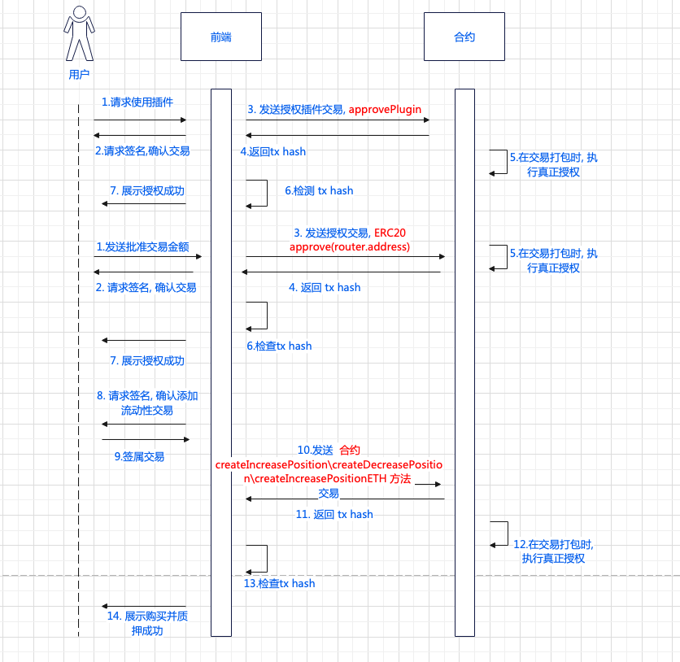

# 限价单: 多头、空头
# 相关合约: 
orderBook: 0xbAC4f7B5956d8666028f0c1413Fc4cC16B34f1D3
router: 0x94caBcB379D61Be3280506F073B903F47E197Fe3

# 主要接口:
  - approvedPlugins(router合约) 检测是否已授权插件
```
    // 无参数
    approvedPlugins(
        address account,   // 用户地址
        address plugin     // 插件地址, 这里指 positionRuoter.address
        ) return(
            bool
            )
```

  - minExecutionFee(positionRuoter合约)
```
    // 无参数
    minExecutionFee() return(uint256 // 最小执行费用)
```

  - approvePlugin(router合约)   授权插件
```
approvePlugin(
    address _plugin  // 插件地址, 在该处不变, 直接传入 positionRouter.address
)
```

  - createIncreaseOrder (orderBook合约) 创建加仓订单
``` 
    createIncreaseOrder(
        address[] _path,         // 路径, 需计算
        uint256 _amountIn,       // 支付代币的数量, 用户输入
        address _indexToken,     // 指数代币, 用户输入
        uint256 _minOut,         // 最小交换输出量, 需计算
        uint256 _sizeDelta,      // 仓位数量, 需根据杠杆计算
        address _collateralToken,// 抵押代币, 用户输入
        bool _isLong,            // 多空, 用户输入
        uint256 _triggerPrice,   // 触发价, 用户输入
        bool _triggerAboveThreshold,  // 触发规则, 触发价判断规则，开多为 True， 开空为False
        uint256 _executionFee,   // 最小执行费用
        bool _shouldWrap         // 如果选则支付代币为WETH 为 True， 否则为 False
    )
```

  - createDecreaseOrder (orderBook合约) 创建减仓订单
```
      createDecreaseOrder(
        address _indexToken,         // 指数代币, 用户输入
        uint256 _sizeDelta,          // 仓位数量, 用户输入
        address _collateralToken,    // 抵押代币的地址
        uint256 _collateralDelta,    // 抵押代币减少的数量
        bool _isLong,                // 多空, 用户输入
        uint256 _triggerPrice,       // 触发价, 用户输入
        bool _triggerAboveThreshold  // 触发价判断规则，开多为 False， 开空为True
        )
```

  - cancelIncreaseOrder (orderBook合约) 取消加仓订单
```  
    cancelIncreaseOrder(
        uint256 _orderIndex          // 订单 索引, 来自后端
        )
```

  - cancelDecreaseOrder (orderBook合约) 取消减仓订单
```
    cancelDecreaseOrder(uint256 _orderIndex)   // 订单索引, 来自后端
```

  - updateIncreaseOrder (orderBook合约) 更新加仓订单
```
      updateIncreaseOrder(
        uint256 _orderIndex,     // 订单索引,来自后端
        uint256 _sizeDelta,      // 仓位增加数量, 用户输入
        uint256 _triggerPrice,   // 触发价, 用户输入
        bool _triggerAboveThreshold  // 触发价判断规则，开多为 True， 开空为False
      )
```

  - updateDecreaseOrder (orderBook合约) 更新加仓订单
```
    updateDecreaseOrder(
        uint256 _orderIndex,         // 订单索引,来自后端
        uint256 _collateralDelta,    // 抵押品减少数量, 用户输入
        uint256 _sizeDelta,          // 仓位减仓数量, 根据杠杆计算
        uint256 _triggerPrice,       // 触发价, 用户输入
        bool _triggerAboveThreshold  // 触发价判断规则，开多为 True， 开空为False
    ) 
```

时序图
