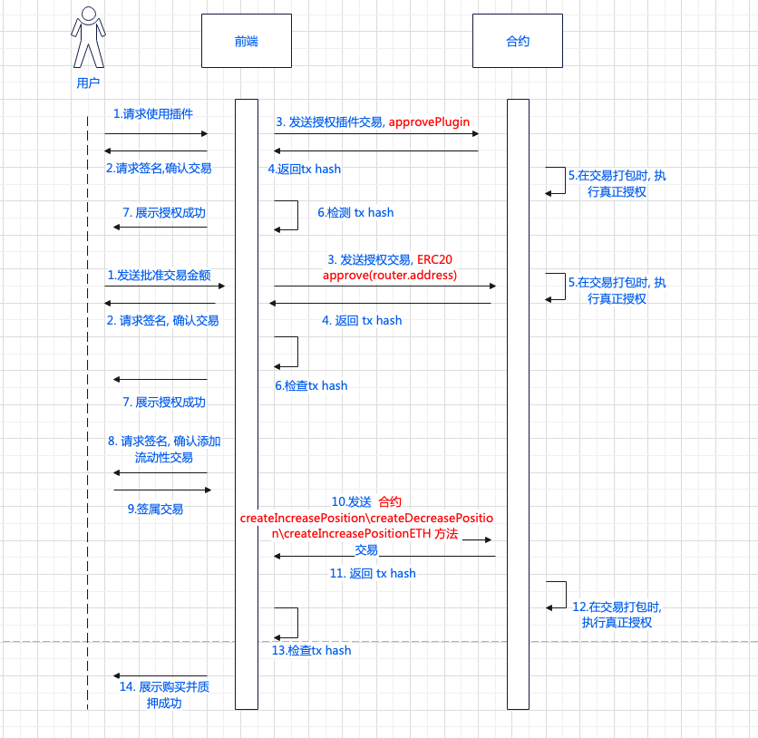

# 市价单: 多头、空头
# 相关合约: 
positionRuoter: 0x4CDA725c6699f9028C1E11302416dBC1263B2CCd

router: 0x94caBcB379D61Be3280506F073B903F47E197Fe3

# 主要接口:
  - approvedPlugins(router合约)  检测是否已授权插件
```
    // 无参数
    approvedPlugins(
        address account,   // 用户地址
        address plugin     // 插件地址, 这里指 positionRuoter.address
        ) return(
            bool
            )
```

  - minExecutionFee(positionRuoter合约)
```
    // 无参数
    minExecutionFee() return(uint256 // 最小执行费用)
```

  - approvePlugin(router合约)   授权插件
```
approvePlugin(
    address _plugin  // 插件地址, 在该处不变, 直接传入 positionRouter.address
)
```

  - createIncreasePosition(positionRuoter合约)
```
  createIncreasePosition(
    address[] _path,           // 路径, 需计算
    address _indexToken,       // 指数代币 (标记价格的),用户输入
    uint256 _amountIn,         // 抵押贷币的数量 (ETH), 用户输入
    uint256 _minOut,           // 最小交换的数量, 需计算
    uint256 _sizeDelta,        // 仓位数量, 根据杠杆计算
    bool _isLong,              // true: 做多, false: 做空, 用户输入
    uint256 _acceptablePrice,  // 可接受的价格, 实时价格输入
    uint256 _executionFee,     // 最小执行费用, 需获取
    bytes32 _referralCode,     // 邀请码, 用户输入
    address _callbackTarget    // 回调目标地址, 写死 address(0)
    ) returns (
        bytes32                // 仓位key值, 传给后端, 后端记录, 可用户查询订单详情
        )
```

  - createDecreasePosition(positionRuoter合约)
```
      createDecreasePosition(
        address[] _path,          // 路径, 需计算
        address _indexToken,      // 指数代币 (标记价格的),用户输入
        uint256 _collateralDelta, // 减少的抵押品数量, 需计算
        uint256 _sizeDelta,       // 减少的仓位数量, 用户输入   
        bool _isLong,             // true: 做多, false: 做空, 用户输入
        address _receiver,        // 接受者地址, 用户输入
        uint256 _acceptablePrice, // 可接受的价格, 实时价格输入
        uint256 _minOut,          // 最小获得代币数量, 需计算
        uint256 _executionFee,    // 最小执行费用, 需获取
        bool _withdrawETH,        // 是否提款ETH, 返回代币是ETH, 为 true, 反之 false 
        address _callbackTarget   // 回调目标地址, 写死 address(0)
        ) returns (
            bytes32               // 仓位key值, 传给后端, 后端记录, 可用户查询订单详情
            )
```

  - createIncreasePositionETH(positionRuoter合约) 不需要erc20代币授权
```
    function createIncreasePositionETH(
        address[] memory _path,   // 路径, 需计算
        address _indexToken,      // 指数代币 (标记价格的),用户输入
        uint256 _minOut,          // 最小交换的数量, 需计算
        uint256 _sizeDelta,       // 仓位数量, 需根据杠杆计算
        bool _isLong,             // true: 做多, false: 做空, 用户输入
        uint256 _acceptablePrice, // 可接受的价格, 实时价格输入
        uint256 _executionFee,    // 最小执行费用, 需获取
        bytes32 _referralCode,    // 邀请码, 用户输入
        address _callbackTarget   // 回调目标地址, 写死 address(0)
    ) returns (
        bytes32                   // 仓位key值, 传给后端, 后端记录, 可用户查询订单详情
        )
```
时序图

